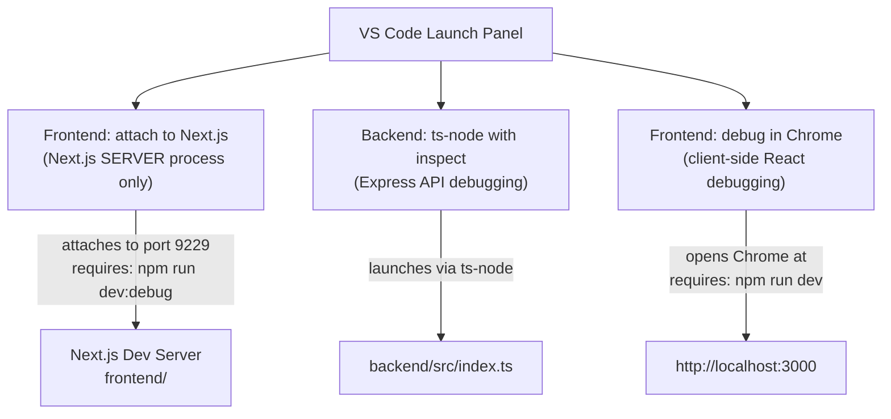

# `.vscode/launch.json` Explanation

This is a **VS Code debugger configuration** file that defines three debug profiles for the project's monorepo structure (a `frontend/` Next.js app + a `backend/` Express server).

---

## The Three Debug Configurations

### 1. `Frontend: attach to Next.js`

```json
"type": "node", "request": "attach", "port": 9229
```

> ⚠️ Despite the name, this debugs the **Next.js Node.js server process** — not browser/client code.

- **Attach** mode — it connects to an already-running Node process rather than launching one itself.
- You must first start the dev server with the inspector enabled. A `dev:debug` script is already defined in `frontend/package.json`:
  ```bash
  cd frontend
  npm run dev:debug
  # → NODE_OPTIONS='--inspect' next dev
  ```
  This opens the debug port `9229`. Running plain `npm run dev` will NOT open the port and the attach will fail.
- Once attached, you can set breakpoints in **server-side code only**:
  - Server Components (files without `"use client"`)
  - Route Handlers (`app/api/route.ts`)
  - Middleware (`middleware.ts`)
  - `cookies()`, `headers()`, `redirect()` calls
- `"restart": true` means VS Code will automatically re-attach if the process restarts (e.g. on hot reload).

> **Note:** `page.tsx` uses `"use client"` — breakpoints there won't be hit by this config. Use **"Frontend: debug in Chrome"** for client components instead.

### 2. `Backend: ts-node with inspect`

```json
"type": "node", "request": "launch", "runtimeArgs": ["--require", "ts-node/register", "--inspect"]
```

- **Launch** mode — VS Code starts the process directly.
- Runs `backend/src/index.ts` through `ts-node` (TypeScript executed directly without a separate compile step).
- The `--inspect` flag opens the Node debugger so breakpoints work in Express route handlers, middleware, etc.
- Sets `NODE_ENV=development` as an environment variable.
- `cwd` is set to `backend/` so relative paths inside the server code resolve correctly.

### 3. `Frontend: debug in Chrome`

```json
"type": "chrome", "request": "launch", "url": "http://localhost:3000"
```

- **Launch** mode — VS Code opens a new Chrome instance pointing at the running dev server.
- Targets **client-side React code** (browser JavaScript) — this is the right config for `"use client"` components, click handlers, `useState`, etc.
- `webRoot` points to `frontend/src` so source maps resolve correctly from bundled code back to your TypeScript/TSX source files.
- Requires the Next.js dev server to already be running (`npm run dev` or `npm run dev:debug`).

---

## Which config should I use?

| What you want to debug | Config to use |
|---|---|
| React components, click handlers, `useState` (`"use client"`) | **Frontend: debug in Chrome** |
| Server Components, API routes, middleware, `cookies()` | **Frontend: attach to Next.js** |
| Express backend (`backend/src/index.ts`) | **Backend: ts-node with inspect** |

---

## Flow Summary



---

## Common Failure: "Frontend: attach to Next.js" won't connect

| Symptom | Cause | Fix |
|---|---|---|
| "Connection refused" on port 9229 | Started with `npm run dev` instead of `npm run dev:debug` | Use `npm run dev:debug` |
| Attaches but breakpoints don't hit | File has `"use client"` — it runs in the browser, not Node | Use **"Frontend: debug in Chrome"** instead |
| Port 9229 already in use | Another Node process is holding the port | Run `lsof -i :9229` to find and kill it |
